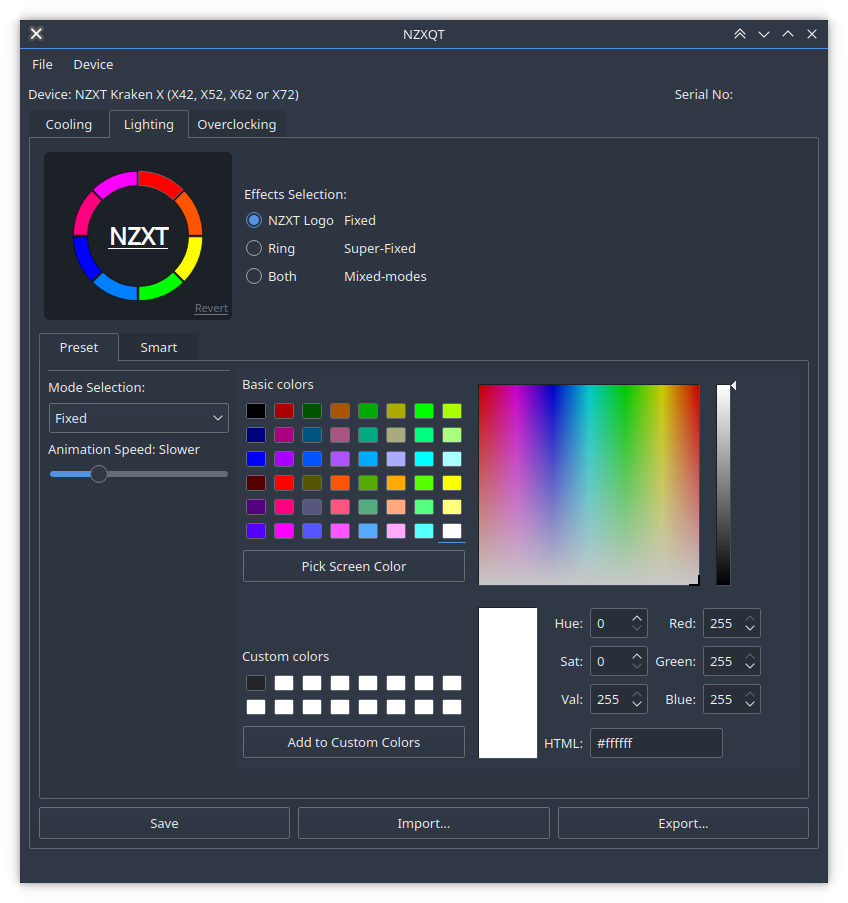

# nzxqt – liquid cooler control graphical user interface

_Cross-platform tool and drivers for liquid coolers and other devices_

## Screenshot

_With the interface able to set the lighting correctly_

<!-- stop here for PyPI -->

## Summary

1. [Requirements](#requirements)
2. [Supported devices](#supported-devices)
3. [Windows and libusb](#windows-and-libusb)
4. [License](#license)
5. [Related projects](#related-projects)

## Requirements

* python3
+ python3-pyqt5
+ python3-pyqtgraph
+ python3-numpy

* sudo NOPASSWD (linux):
> $USER ALL=(ALL) NOPASSWD:ALL

## Supported devices
See [jonasmalacofilho/liquidctl](https://github.com/jonasmalacofilho/liquidctl) for device support, with full implementation to be added to nzxqt

### Windows and libusb

On Windows, libusb v1.0.21 is recommended over the latest v1.0.22.  A known issue with PyUSB generates some annoying – if probably harmless – errors when trying to release the device.

A simple way of installing it is to download the appropriate package from [libusb/releases](https://github.com/libusb/libusb/releases) and extract the `.dll` and `.lib` files that match you runtime (e.g. MS64) to your python installation directory (e.g. `%homepath%\Anaconda3\`).

## License

nzxqt - Copyright (C) 2018  Wepiha Te Ata
Copyright (C) 2018  each contribution's author

Incorporates work by Jonas Malaco, leaty, KsenijaS, Alexander Tong and Jens Neumaier, under
the terms of the GNU General Public License.

This program is free software: you can redistribute it and/or modify
it under the terms of the GNU General Public License as published by
the Free Software Foundation, either version 3 of the License, or
(at your option) any later version.

**This program is distributed in the hope that it will be useful,
but WITHOUT ANY WARRANTY; without even the implied warranty of
MERCHANTABILITY or FITNESS FOR A PARTICULAR PURPOSE.**  See the
GNU General Public License for more details.

You should have received a copy of the GNU General Public License
along with this program.  If not, see <https://www.gnu.org/licenses/>.

## Related projects

### [jonasmalacofilho/liquidctl](https://github.com/jonasmalacofilho/liquidctl)

liquidctl is a cli tool and driver to control liquid coolers and other devices

### [KsenijaS/krakenx](https://github.com/KsenijaS/krakenx)

Another cross-plataform interface for controlling third generation NZXT Kraken X coolers.

While liquidctl handles each setting separately, for easy configuration of individual aspects of the coolers, krakenx allows a device to be completely configured in a single command.

Feature wise, liquidctl currently extends krakenx with the support for pump and fan speed profiles, and fixes two open issues that seem to manifest with recent firmware versions.  It also further extends the list of supported RGB animations.

A special thank you to all krakenx contributors.  This project would not exist were not for it.

### [brkalmar/leviathan](https://github.com/brkalmar/leviathan)

Linux kernel-space driver for second and third generation NZXT Kraken X coolers.

### [audiohacked/OpenCorsairLink](https://github.com/audiohacked/OpenCorsairLink)

Command-line tool to control Corsair all-in-one liquid coolers and other devices.

<!-- helper links -->
[newissue]: https://github.com/jonasmalacofilho/liquidctl/issues/new
